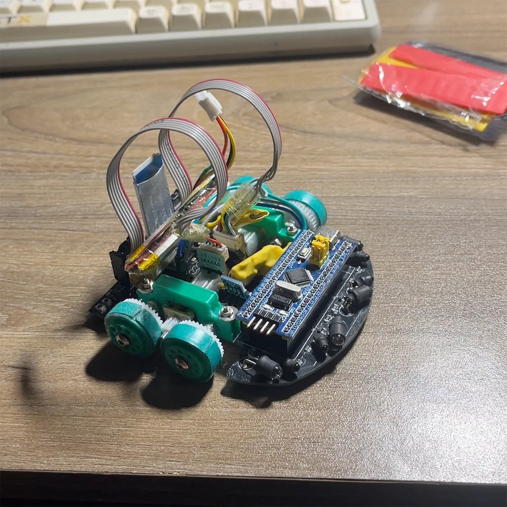

# Micromouse TST - Tiny Smart Turtles (Version 1)

**Tiny Smart Turtles** is an Arduino-based Micromouse project that implements the classic BFS Floodfill algorithm for autonomous maze solving. The system incorporates infrared sensors for wall detection, motor encoders for distance tracking, and a PID controller to ensure straight movement and precision turns.



## 📌 Features
- **Maze Solving Algorithm**: Implements a Breadth-First Search (BFS) Floodfill algorithm to find the optimal path to the complex maze center.
- **Wall Following & Stabilization**: Uses a PID controller relying on 4 Infrared (IR) sensors (Front-Left, Front-Right, Side-Left, Side-Right) to maintain equilibrium between walls.
- **Odometry & Dead Reckoning**: Motor encoders allow for accurate distance tracking (forward/backward) and precise 90°/180° turns.
- **Hardware Telemetry via Bluetooth**: Send debugging and diagnostic data over a serial Bluetooth connection (HC-05/06) at 9600 Baud for remote monitoring.
- **Multi-phase Execution**: Explores the maze to find the center, calculates the shortest path, and performs a final speed run.

## 🛠 Hardware Components
- **Microcontroller**: STM32 BluePill.
- **Motor Driver**: TB6612.
- **Sensors**: 
  - 4x IR Emitters & Receivers.
  - Quadrature Encoders attached to left and right motors.
- **Wireless Comms**: Bluetooth Module via Hardware Serial 3 (`PB10/PB11`).
  
## Project Structure
- `TST_v1/TST_v1.ino`: The main Arduino sketch containing the motor configurations, PID logic, IR sensor reading algorithms, and the Floodfill maze-solving logic.
- `pics/`: Contains hardware schematics and photos of the Micromouse.
- `video/`: Contains footage of the turtle in action.

## Setup & Installation
1. Clone this repository to your local machine:
   ```bash
   git clone https://github.com/minhtoan-tran/Micromouse-tiny-smart-turtles-v1.git
   ```
2. Open the `TST_v1.ino` sketch using the **Arduino IDE** (or VS Code with PlatformIO).
3. Ensure you have the correct Board Definition installed (e.g., STM32duino if using an STM32 board).
4. Connect the board via USB, select the correct COM port, and click **Upload**.

## Usage & Diagnostics
- **Bluetooth Serial**: Once powered on, connect to the robot's Bluetooth module using a Serial Terminal app on your phone or PC.
- **Telemetry**: You will receive real-time IR sensor readings `[IR] SL:... SR:... FL:... FR:...` as well as algorithm decisions (e.g., `[FF] DECISION = FORWARD`).
- **Calibration**: The `SIDE_WALL_ON_MAX` and `SIDE_WALL_OFF_MIN` thresholds can be tuned in the code to match your specific maze's ambient lighting and wall reflectiveness.


